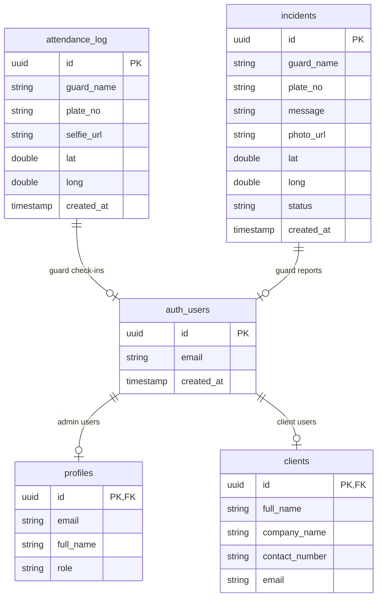

# AHE SmartPatrol - Database Schema

## Database Overview

**Database**: PostgreSQL via Supabase  
**Security**: Row Level Security (RLS) enabled  
**Real-time**: WebSocket subscriptions for live updates  
**Storage**: Supabase Storage for photo uploads  

## Core Tables

### profiles
**Purpose**: Admin user management  
**RLS**: Enabled  

| Column | Type | Constraints | Description |
|--------|------|-------------|-------------|
| id | uuid | PRIMARY KEY | Links to Supabase auth.users.id |
| email | text | NOT NULL | Admin email address |
| full_name | text | NOT NULL | Admin full name |
| role | text | NOT NULL | Always 'admin' for this table |

**Usage**: `src/context/AuthContext.jsx`, `src/pages/Register.jsx`

### clients  
**Purpose**: Client/company management  
**RLS**: Enabled  

| Column | Type | Constraints | Description |
|--------|------|-------------|-------------|
| id | uuid | PRIMARY KEY | Links to Supabase auth.users.id |
| full_name | text | NOT NULL | Client contact name |
| company_name | text | NOT NULL | Company/site name |
| contact_number | text | NULL | Phone number |
| email | text | NOT NULL | Client email |

**Usage**: `src/pages/Register.jsx` (client registration)

### attendance_log
**Purpose**: Guard selfie check-ins with GPS verification  
**RLS**: Enabled  
**Migration**: `20241225000014_create-attendance-log-table.sql`

| Column | Type | Constraints | Description |
|--------|------|-------------|-------------|
| id | uuid | PRIMARY KEY | Auto-generated UUID |
| guard_name | text | NULL | Guard name from localStorage |
| plate_no | text | NULL | Vehicle plate number |
| selfie_url | text | NULL | Supabase storage URL for selfie photo |
| lat | double precision | NULL | GPS latitude |
| long | double precision | NULL | GPS longitude |
| created_at | timestamptz | DEFAULT now() | Check-in timestamp |

**Indexes**:
- `idx_attendance_log_guard_name` on `guard_name`
- `idx_attendance_log_created_at` on `created_at`

**Usage**: `src/pages/guard/SelfieCheckIn.jsx`, `src/pages/guard/Dashboard.jsx`

### incidents
**Purpose**: Incident reports with photo evidence  
**RLS**: Enabled  
**Migration**: `20241225000016_add-incidents-status-column.sql`

| Column | Type | Constraints | Description |
|--------|------|-------------|-------------|
| id | uuid | PRIMARY KEY | Auto-generated UUID |
| guard_name | text | NULL | Guard who reported incident |
| plate_no | text | NULL | Vehicle plate number |
| message | text | NULL | Incident description |
| photo_url | text | NULL | Supabase storage URL for incident photo |
| lat | double precision | NULL | GPS latitude of incident |
| long | double precision | NULL | GPS longitude of incident |
| status | text | DEFAULT 'active' | 'active' or 'archived' |
| created_at | timestamptz | DEFAULT now() | Incident timestamp |

**Indexes**:
- `idx_incidents_status` on `status`
- `idx_incidents_status_created_at` on `(status, created_at)`

**Auto-archiving**: Records older than 30 days automatically set to 'archived'

**Usage**: `src/pages/guard/IncidentForm.jsx`, `src/pages/admin/AdminIncident.jsx`

## Row Level Security (RLS) Policies

### attendance_log Policies
```sql
-- Guards can insert their own attendance records
CREATE POLICY "Guards can insert their own attendance records" 
ON attendance_log FOR INSERT WITH CHECK (true);

-- Guards can view their own attendance records  
CREATE POLICY "Guards can view their own attendance records"
ON attendance_log FOR SELECT USING (true);

-- Admins can view all attendance records
CREATE POLICY "Admins can view all attendance records"
ON attendance_log FOR ALL USING (true);
```

### Other Tables
- **profiles**: Admin-only access
- **clients**: Client self-access + admin access
- **incidents**: Guard insert + admin full access

## Real-time Subscriptions

### Guard Location Tracking
```javascript
// From src/components/shared/MapRealtime.jsx
const channel = supabase
  .channel("guard_location")
  .on("broadcast", { event: "location_update" }, ({ payload }) => {
    // Update guard positions on map
  })
  .subscribe();
```

### Incident Alerts
- **Edge Function**: `supabase/functions/incident-alert/index.ts`
- **Trigger**: Database insert on `incidents` table
- **Action**: Telegram bot notification with photo

## Storage Integration

### Photo Storage
- **Bucket**: Supabase Storage for photos
- **Types**: Selfie check-ins, incident photos
- **URLs**: Stored in `selfie_url` and `photo_url` columns
- **Access**: Public URLs for Telegram integration

### File Upload Flow
1. Camera capture or file selection
2. Upload to Supabase Storage
3. Get public URL
4. Store URL in database record
5. Send to Telegram (for incidents)

## Database Relationships

### Entity Relationship Diagram



## Data Flow

### Registration Flow
1. **Supabase Auth**: User signs up with email/password
2. **Role Check**: `admin@ahetech.my` → `profiles` table
3. **Client Check**: Other emails → `clients` table
4. **Redirect**: Role-based dashboard redirect

### Guard Check-in Flow
1. **Camera Access**: Guard takes selfie
2. **GPS Capture**: Location coordinates recorded
3. **Storage Upload**: Photo uploaded to Supabase Storage
4. **Database Insert**: Record created in `attendance_log`
5. **Real-time Update**: Map updates with new location

### Incident Reporting Flow
1. **Photo Capture**: Guard takes incident photo
2. **Description**: Incident details entered
3. **Storage Upload**: Photo uploaded to Supabase Storage
4. **Database Insert**: Record created in `incidents`
5. **Edge Function**: Triggers Telegram notification
6. **Admin Alert**: Real-time notification to admin dashboard

## Performance Optimizations

### Indexes
- **attendance_log**: `guard_name`, `created_at`
- **incidents**: `status`, `(status, created_at)`

### Archiving Strategy
- **incidents**: Auto-archive records older than 30 days
- **Status Filtering**: Active vs archived incident management

### Real-time Efficiency
- **Selective Subscriptions**: Only subscribe to relevant channels
- **Payload Optimization**: Minimal data in real-time broadcasts
- **Connection Management**: Proper cleanup of subscriptions

## Security Considerations

### Row Level Security
- **User Isolation**: Users can only access their own data
- **Admin Override**: Admins have full access to all records
- **Guard Privacy**: Guards can only see their own attendance

### Data Validation
- **Required Fields**: Email, full_name, role validation
- **GPS Accuracy**: Location verification for check-ins
- **Photo Validation**: Image file type and size limits

### Access Control
- **Authentication**: Supabase Auth integration
- **Authorization**: Role-based route protection
- **Session Management**: Automatic logout and redirect
